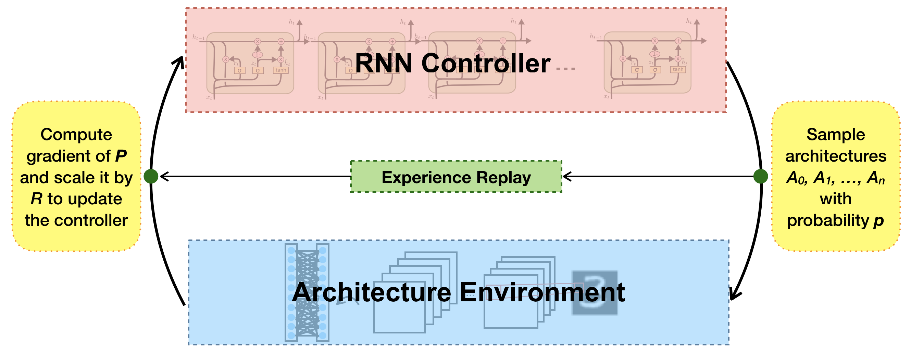

# COMP767 Project: Neural Architecture Search with Reinforcement Learning

## Contact Information
Olga (Geya) Xu, 260520542

geya.xu@mail.mcgill.ca

## Model Description


## Dependencies
* numpy==1.14.2
* torch.egg==info
* torchvision==0.2.0
* torch==0.4.0a0+6a41e2d

## Train Models
### MNIST
```
python run_mnist.py
```
usage: run_mnist.py [-h] [--batch-size BATCH_SIZE] [--max-layers MAX_LAYERS]
                    [--alpha ALPHA] [--gamma GAMMA] [-lr LEARNING_RATE]
                    [--num-episodes NUM_EPISODES] [--model-dir MODEL_DIR]
                    [--model-name MODEL_NAME] [--save-freq SAVE_FREQ]
### CIFAR-10
```
python run_cifar.py
```
usage: run_cifar10.py [-h] [--batch-size BATCH_SIZE] [--max-layers MAX_LAYERS]
                      [--alpha ALPHA] [--gamma GAMMA] [-lr LEARNING_RATE]
                      [--num-episodes NUM_EPISODES] [--model-dir MODEL_DIR]
                      [--model-name MODEL_NAME] [--check-memory]
                      [--save-freq SAVE_FREQ] [--load-model LOAD_MODEL]
## Test Models
### MNIST
```
python test_mnist.py --load-model [MODEL]
```
usage: test_mnist.py [-h] [--batch-size BATCH_SIZE] [--max-layers MAX_LAYERS]
                     [--alpha ALPHA] [-lr LEARNING_RATE]
                     [--num-epochs NUM_EPOCHS] [--model-dir MODEL_DIR]
                     [--model-name MODEL_NAME] [--load-path LOAD_PATH]
### CIFAR-10
```
python test_cifar.py --load-model [MODEL]
```
usage: test_cifar.py [-h] [--batch-size BATCH_SIZE] [--alpha ALPHA]
                     [-lr LEARNING_RATE] [--num-epochs NUM_EPOCHS]
                     [--model-dir MODEL_DIR] [--model-name MODEL_NAME]
                     [--load-path LOAD_PATH]

## Display Replay Tree
```
python print_experience_tree.py --load-model [MODEL]
```
usage: print_experience_tree.py [-h] --load-model LOAD_MODEL

## Reference
* *Neural Architecture Search with Reinforcement Learning* [[arxiv](https://arxiv.org/pdf/1611.01578.pdf)]
* *Convolutional Neural Network Architecture Seach with Q-Learning* [[paper](http://cs231n.stanford.edu/reports/2017/pdfs/528.pdf)]
